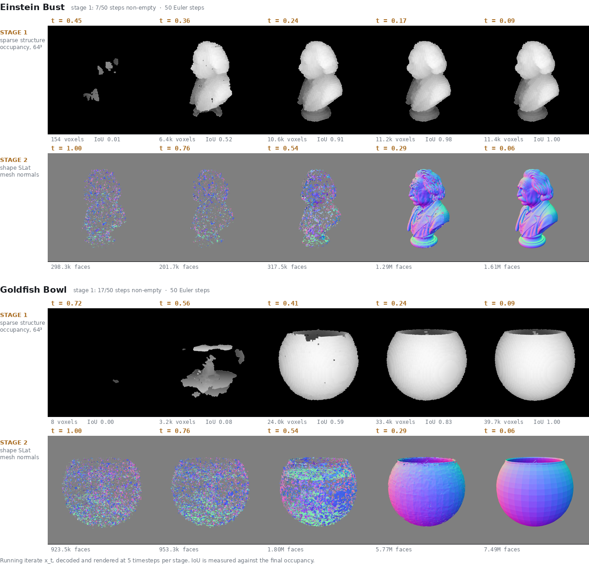

# Assignment — Deploying TRELLIS.2 for Conditional 3D Generation

Deadline: 23:59, September, 21th, 2026

---

## Goal

Deploy [microsoft/TRELLIS.2-4B](https://huggingface.co/microsoft/TRELLIS.2-4B) on a GPU and use it to generate 3D assets from **image** and **text** conditioning. Then go one level deeper: extract and visualise the **intermediate states of the diffusion (flow-matching) process**, not just the final meshes.

The point of this assignment is not to run a demo script. It is to (a) get a large, dependency-heavy research model actually working on real hardware, and (b) demonstrate that you understand what the sampler is doing internally by pulling out and rendering its intermediate states.

---

## Prerequisites


| Requirement                        | Notes                                                          |
| ---------------------------------- | -------------------------------------------------------------- |
| Linux machine with an NVIDIA GPU   | **≥ 24 GB VRAM.** Below that you will need the low-VRAM path.  |
| CUDA-capable driver                | Any driver supporting CUDA 12.4 or newer.                      |
| conda / miniconda                  | Or another environment manager you can defend.                 |
| ~60 GB free disk                   | Model weights alone are large.                                 |
| Python, PyTorch, basic 3D literacy | You should know what a mesh, a normal, and a voxel are.        |

You do **not** need a system-wide CUDA toolkit install, and you should not need root.

---

## Step 0 — select the GPU server

Consider use an GPU cloud service either from SoC, NUS HPC, NSCC, or external vendor (Lambdalab, autoDL, etc.).

**Reimbursement:**
* For Individual/Group (Students) subscriptions, please inform your students to submit their claims via the SoC Claims Hub (https://mysoc.nus.edu.sg/app/claims) from Week 1 onwards.
* For more details on managing these requests, please refer to the AI Tool FAQ (https://mysoc.nus.edu.sg/itu/ai-tool-faq/).
* If you have questions about your requests, especially highlighted rows, please send a request to SoC RT.

---

## Step 1 — Download the model weights (5 pt)

Download the checkpoints the pipeline requires. The main model repository is not sufficient on its own: the pipeline also needs a decoder checkpoint from an earlier TRELLIS release, an image conditioner, and a background-removal model. For Step 3b, you will also need a text-to-image model.


| Model                                                           | Role                                                                                      | Approx. size |
| --------------------------------------------------------------- | ----------------------------------------------------------------------------------------- | ------------ |
| `microsoft/TRELLIS.2-4B`                                        | the model itself — flow transformers plus shape and texture VAEs                          | 16 GB        |
| `microsoft/TRELLIS-image-large`                                 | sparse-structure decoder checkpoint (`ckpts/ss_dec_conv3d_16l8_fp16.*` only)              | 150 MB       |
| DINOv3 ViT-L/16 (`facebook/dinov3-vitl16-pretrain-lvd1689m`)    | image conditioner — encodes the input image into the features the model is conditioned on | 1.2 GB       |
| A background-removal model (e.g.`briaai/RMBG-2.0`, or BiRefNet) | mattes the input image so the object is isolated before conditioning                      | 0.5 GB       |
| A text-to-image model (e.g.`black-forest-labs/FLUX.1-schnell`)  | needed only for Step 3b — see that step                                                   | 32 GB        |

Note that some of these repositories are **gated** and require an authorised Hugging Face token.

**Deliverable.** In your report: state which models you downloaded, and where you obtained each one. If you used a substitute for any model, say which and why. However, please note that the 3D generation model is mandatory. You are only allowed to use trellis.2-4b.

---

## Step 2 — Build the environment (5 pt)

Install all dependencies into an **isolated Python virtual environment** (conda env, venv, or equivalent). Do not install into a shared or system interpreter. This model requires several **compiled CUDA extensions**, not just pip packages. Expect to build from source.

**Deliverable.** In your report:

- The commands used to create the environment and install everything into it, in order and copy-pasteable.
- The list of packages you installed, with versions — including Python, PyTorch, the CUDA toolchain, and every compiled extension.

---

## Step 3 — Deploy and generate (30 pt)

Get the model generating 3D assets on your GPU, under both conditioning modes.

### 3a. Image-conditioned — 5 examples

Generate 5 assets from **your own images**. Do not reuse more than two of the repository's bundled examples; please pick or make your own. Choose images that stress different capabilities (thin structures, hard surfaces, transparency, organic shapes, etc.) and say why you chose each.

This is the model's native path:

```
your image  -->  background removal  -->  image encoder     -->  TRELLIS.2-4B  -->  3D asset
                 RMBG-2.0 / BiRefNet      DINOv3 ViT-L/16         (4B params)        .glb
```

The background-removal and image-encoder models are the ones you downloaded in Step 1. Note that if your input already has a transparent background, the matting step is skipped — so what
you feed in determines which parts of this chain actually run.

### 3b. Text-conditioned — 5 examples

Generate 5 assets from **your own text prompts**.

TRELLIS.2 is an **image-conditioned model only** — it has no text-conditioned checkpoints, and its only conditioner is the image encoder. Text conditioning therefore has to be *chained*: you must put a text-to-image model in front of it, so that

```
prompt  -->  text-to-image   -->  single object image  -->  [ the Step 3a pipeline ]  -->  3D asset
             FLUX.1-schnell                                  RMBG-2.0 / BiRefNet             .glb
                                                             DINOv3 ViT-L/16
                                                             TRELLIS.2-4B
```

You are required to build this chain yourself. Two things matter for it to work well:

- **The generated image must look like the inputs TRELLIS.2 expects** — one object, centred, fully visible, on a plain background, evenly lit, no hard shadows. Engineer your prompt so the text-to-image stage produces that, and show the prompt template you used.
- **Be explicit about the limitation.** The 3D model never sees your text; prompt fidelity is bounded by whatever the text-to-image stage draws. State this in your report and give at least
  one example where it visibly affected the result.

**Deliverable.** 
- The 10 `.glb` files, plus rendered previews of each in the report (at least 2 viewpoints per asset so geometry is assessable, not just one flattering angle). 
- The time cost for each generation.
- The input images and text prompts.

---

## Step 4 — Visualise the diffusion process (40 pt)

TRELLIS.2 does not denoise once — it runs **two separate diffusion stages**, one after the other. A coarse stage first decides *where* geometry exists, and a second stage then fills in
the detail on that structure. Each stage is its own flow-matching sampler with its own timestep schedule, its own latent space, and its own decoder.

Pick **3 of your image-conditioned generations** from Step 3a. For each of those 3, extract and render **5 intermediate states from _each_ of the two stages** — 10 renders per case, 30 in
total. You do not need to do this for the other Step 3 outputs.

### What is required

1. **Identify both stages.** Find where each of the two stages is sampled and say what each one produces. They do not share a latent space or a decoder, so you will need to handle them separately.
2. **Extract the running iterate `x_t` from the sampler** — the state the sampler actually carries forward at each timestep. Read the sampler implementation before writing any code; you may find you do not need to modify it at all.
3. **Decode intermediates into something viewable.** A raw latent is not a result. Convert each captured state into a renderable 3D representation and render it.
4. **Label every frame with its true timestep `t`,** and with which stage it belongs to. Do not assume the timesteps are uniformly spaced — read how each schedule is actually constructed
   and report the real values. The two stages do not necessarily share a schedule.
5. **Take your 5 frames from the timestep range where each stage actually shows something.**

   | Stage                     | Take 5 steps across     |
   | --------------------------- | ------------------------- |
   | 1&mdash; coarse structure | `t` from **0.5 to 0.0** |
   | 2&mdash; shape detail     | `t` from **1.0 to 0.0** |

   Stage 1 decodes to an empty result above `t` &asymp; 0.5, so sampling its full range would
   waste most of your frames on blank renders. Note that at its default step count there are
   only two or three steps below `t` = 0.5 &mdash; raise that stage's number of Euler steps
   until you have 5 distinct ones to choose from, and report the step count you used.

**Deliverable.** 
- For each of the 3 chosen cases: two labelled strips of 5 renders each, one per stage, including input image and output rendered assset image
- A written explanation of your extraction method — which function you hooked, what you captured, how you decoded it for each stage.

### What it should look like

Two worked examples in the expected format — 5 frames per stage, each labelled with its real
timestep and a measurement:



The two stages behave differently, and your figures should make that visible. Stage 1 discovers *where* geometry exists: it starts from a handful of scattered voxels carrying essentially no shape and converges to the final occupancy. Stage 2 starts from a noise-crusted shell that already occupies roughly the right silhouette, and resolves it into a clean surface.

---

## Step 5 — Composite a scene (10 pt)

Combine assets you generated into a **single 3D scene of your own design**. The idea is yours. Anything that shows the assets placed together deliberately rather than dumped at the origin is valid.

**Requirements.**

- Generate at least 5 assets for this scene. You may reuse your Step 3 outputs if you want.
- Position, orient and scale them intentionally. Assets should sit at a consistent scale and
  make contact with whatever supports them.
- Export the whole scene as a **single scene file** (`.glb` preferred; `.blend` or `.usd`
  accepted).
- Include at least one rendered view of the scene in your report.
- Use any software for your scene arrangement, but you have to use the 3D assets from your generation model.

**Deliverable.** 
- The scene file.
- A rendered view. 
- A short paragraph on what you were going for and how you assembled it (which tool, how you handled scale and placement).

---

## Submission

Submit **one PDF report**, your **10 `.glb` assets**, and **one scene file**.

### The report must contain
The deliverables in each step that related to report

---

## Grading summary


| Item                                             | Marks   |
| -------------------------------------------------- | --------- |
| Step 1 — Download the model weights             | 5       |
| Step 2 — Build the environment                  | 5       |
| Step 3 — Deploy and generate (5 image + 5 text) | 30      |
| Step 4 — Visualise the diffusion process        | 40      |
| Step 5 — Composite a scene                      | 10      |
| **Core total**                                   | **90**  |
| Optional extensions                              | 10      |
| **Maximum**                                      | **100** |

Within Steps 3 and 4, marks are awarded for a working deployment, evidence that
you understand what each stage of the pipeline did, and honest reporting — not
for the most attractive mesh. A modest result you can explain scores better than
a good one you cannot.

* Report Score (65%): Includes report for step 1 (5pt), 2 (5pt), 3 (20pt), 4 (20pt), 5 (5pt) and optional parts (10pt)
* Oral Score (35%): Includes questions for step 3 (10pt), 4 (20pt) and 5 (5pt)

### Optional extensions (10 pt)

Any one of these, done well and written up, earns the optional marks. Pick one — depth beats
breadth.

- **Generate at a higher resolution.** The pipeline supports settings above the default. Report
  the cost in time and memory, and show what actually improves.
- **creative scene creation.** Make the scene interesting and beautiful, render it using a production-level renderer.

---

## Rules

- You may read the model's source, its documentation, and its paper. You are expected to.
- You may use AI assistance for code and writing report, but **you must be able to explain every line you submit**,
  and your report must be your own analysis.
- Report what actually happened. A partially working deployment, honestly documented with a correct diagnosis of what failed, will score better than an unsupported claim of success.
