# TRELLIS.2 Conditional 3D Generation

## Overview

This project deploys `microsoft/TRELLIS.2-4B` on an NVIDIA GPU and uses it to generate 3D assets from image and text inputs. Since TRELLIS.2 is image-conditioned, text-to-3D generation is implemented as a text-to-image stage followed by the standard image-to-3D pipeline.

The project also investigates the model's two-stage flow-matching process by extracting, decoding, and rendering intermediate sampler states. Finally, generated assets are assembled into a composed 3D scene.

Current progress: **Steps 1–4 complete — awaiting approval to start Step 5.**

## Table of Contents

- [Step 1 — Download Model Weights](#step-1--download-model-weights)
- [Step 2 — Build the Environment](#step-2--build-the-environment)
- [Step 3 — Deploy and Generate](#step-3--deploy-and-generate)
  - [Step 3a — Image-Conditioned Generation](#step-3a--image-conditioned-generation)
  - [Step 3b — Text-Conditioned Generation](#step-3b--text-conditioned-generation)
  - [Step 3 Acceptance Audit](#step-3-acceptance-audit)
- [Step 4 — Visualise the Diffusion Process](#step-4--visualise-the-diffusion-process)
- [Step 5 — Composite a Scene](#step-5--composite-a-scene)
- [Submission Checklist](#submission-checklist)

## Step 1 — Download Model Weights

### Objective

Obtain all model checkpoints required by the image-to-3D and text-to-3D pipelines.

Required models:

| Model | Purpose |
|---|---|
| `microsoft/TRELLIS.2-4B` | Main two-stage 3D generation model; mandatory |
| `microsoft/TRELLIS-image-large` | Sparse-structure decoder checkpoint: `ckpts/ss_dec_conv3d_16l8_fp16.*` |
| `facebook/dinov3-vitl16-pretrain-lvd1689m` | Image-condition encoder |
| `briaai/RMBG-2.0` or BiRefNet | Input-image background removal |
| `black-forest-labs/FLUX.1-schnell` or an equivalent model | Converts text prompts into single-object images for text-to-3D generation |

### Implementation

The weights were downloaded on the NUS SoC Compute Cluster. A CPU job in the Slurm `long` partition performed the download because this stage required network and storage resources rather than a GPU. A read-only Hugging Face token was used after access had been granted to the gated DINOv3, RMBG-2.0, and FLUX repositories.

The download tools used Python 3.13.13, Hugging Face CLI 1.31.0, and `hf_xet`. The cache was placed in persistent shared storage:

```text
/home/h/hongshan/cp4281-as2/hf-cache
```

The main download commands were:

```bash
hf download microsoft/TRELLIS.2-4B
hf download microsoft/TRELLIS-image-large \
  --include "ckpts/ss_dec_conv3d_16l8_fp16.*"
hf download facebook/dinov3-vitl16-pretrain-lvd1689m
hf download briaai/RMBG-2.0
hf download black-forest-labs/FLUX.1-schnell \
  --exclude "flux1-schnell.safetensors"
```

The complete reproducible Slurm download job and verification procedure are preserved in [`scripts/download_models.sbatch`](scripts/download_models.sbatch) and [`scripts/verify_models.sh`](scripts/verify_models.sh).

The standalone `flux1-schnell.safetensors` file was excluded because the required Diffusers-format transformer, text encoders, and VAE were downloaded from the same repository. This avoided storing a duplicate 23.8 GB FLUX checkpoint.

### Results

Step 1 was completed successfully. Slurm job `849112` finished with `COMPLETED`, exit code `0:0`, in 13 minutes 29 seconds. The resulting Hugging Face cache occupies 53 GB, and no `.incomplete` files were found.

| Model | Revision | Cache size | Verification |
|---|---|---:|---|
| `microsoft/TRELLIS.2-4B` | `af44b45f2e35a493886929c6d786e563ec68364d` | 16 GB | 9 safetensors files found |
| `microsoft/TRELLIS-image-large` | `25e0d31ffbebe4b5a97464dd851910efc3002d96` | 141 MB | Required JSON and safetensors decoder files found |
| `facebook/dinov3-vitl16-pretrain-lvd1689m` | `ea8dc2863c51be0a264bab82070e3e8836b02d51` | 1.2 GB | `model.safetensors` found |
| `briaai/RMBG-2.0` | `5df4c9c76d8170882c34f6986e848ee07fd0ba43` | 3.9 GB | `model.safetensors` found |
| `black-forest-labs/FLUX.1-schnell` | `741f7c3ce8b383c54771c7003378a50191e9efe9` | 32 GB | 8 Diffusers safetensors files and `model_index.json` found |

The full verification manifest is stored on the cluster at:

```text
/home/h/hongshan/cp4281-as2/logs/model-manifest.txt
```

All weights were obtained from their official Hugging Face repositories:

- [`microsoft/TRELLIS.2-4B`](https://huggingface.co/microsoft/TRELLIS.2-4B)
- [`microsoft/TRELLIS-image-large`](https://huggingface.co/microsoft/TRELLIS-image-large)
- [`facebook/dinov3-vitl16-pretrain-lvd1689m`](https://huggingface.co/facebook/dinov3-vitl16-pretrain-lvd1689m)
- [`briaai/RMBG-2.0`](https://huggingface.co/briaai/RMBG-2.0)
- [`black-forest-labs/FLUX.1-schnell`](https://huggingface.co/black-forest-labs/FLUX.1-schnell)

No substitute 3D model was used. RMBG-2.0 and FLUX.1-schnell were selected from the implementations suggested by the assignment.

### Cluster Artifacts

| Cluster path | Purpose | Keep for submission? |
|---|---|---|
| `~/cp4281-as2/download_models.sbatch` | Slurm job that downloaded all required checkpoints | Keep as reproducibility evidence; not a submitted file |
| `~/cp4281-as2/verify_models.sh` | Verifies revisions, required files, weight counts, and incomplete downloads | Keep as reproducibility evidence; not a submitted file |
| `~/cp4281-as2/hf-cache/` | The 53 GB model cache used by later inference jobs | Keep on the cluster; do not submit |
| `~/cp4281-as2/logs/download-models-849112.log` | Download timing, node, versions, and completion log | Keep as evidence; do not submit |
| `~/cp4281-as2/logs/model-manifest.txt` | Verified revisions, sizes, and checkpoint inventory | Keep for the report; do not submit separately |
| `~/cp4281-as2/access-check/` | Small files used only to test gated-repository access | Temporary; not needed for submission |
| `~/cp4281-as2/tools/hf-download-env/` | Lightweight Hugging Face download environment | Re-creatable; not the Step 2 runtime environment |
| `~/cp4281-as2/tmp/` | Temporary download workspace | Not needed for submission after successful verification |

## Step 2 — Build the Environment

### Objective

Create an isolated, reproducible runtime for TRELLIS.2 with its required CUDA toolchain and source-built native extensions. No package was installed into the cluster's system Python.

### Implementation

The environment was created at:

```text
/home/h/hongshan/cp4281-as2/envs/trellis2
```

Miniconda was loaded explicitly because non-interactive Slurm shells do not automatically source the user's `.bashrc`:

```bash
source "$HOME/miniconda3/etc/profile.d/conda.sh"
conda activate "$HOME/cp4281-as2/envs/trellis2"
```

The installation was performed in the following order:

1. Create a Python 3.10 environment and install the CUDA 12.4 compiler toolkit, GCC/G++ 12, CMake, and Ninja.
2. Install PyTorch 2.6.0 and torchvision 0.21.0 using their CUDA 12.4 builds.
3. Install the standard Python dependencies required by TRELLIS.2.
4. Clone TRELLIS.2 recursively and retain its exact Git revision.
5. Compile and test FlashAttention.
6. Compile and test `nvdiffrast` and `nvdiffrec_render`.
7. Compile and load-test CuMesh, O-Voxel, and FlexGEMM.
8. Import the complete TRELLIS.2 pipeline and export final pip, conda, version, and source-revision manifests.
9. Extend the same isolated environment for Step 3b with Diffusers, Accelerate, and psutil, then verify `FluxPipeline`, the pinned local FLUX snapshot, and `pip check` in a Slurm CPU job.

Compilation ran in Slurm GPU jobs against an NVIDIA A100 80 GB PCIe MIG 3g.40gb instance. Temporary build trees and pip caches were placed together under `/tmp` to avoid cross-filesystem wheel operations. CUDA extensions were built for compute capability 8.0. The CUDA driver stub directory was supplied only to the linker for extensions that link against `libcuda.so`.

The reproducible scripts retained in this repository are:

| Script | Purpose |
|---|---|
| [`scripts/setup_step2_render.sbatch`](scripts/setup_step2_render.sbatch) | Build and functionally test `nvdiffrast` and `nvdiffrec_render` |
| [`scripts/setup_step2_geometry.sbatch`](scripts/setup_step2_geometry.sbatch) | Build and load-test CuMesh, O-Voxel, and FlexGEMM |
| [`scripts/verify_step2_environment.sbatch`](scripts/verify_step2_environment.sbatch) | Perform the final TRELLIS.2 import, CUDA execution, dependency, version, and revision checks |
| [`scripts/setup_step3b_accelerate.sbatch`](scripts/setup_step3b_accelerate.sbatch) | Add the pinned Accelerate dependency required by Diffusers offload support |
| [`scripts/setup_step3b_diffusers.sbatch`](scripts/setup_step3b_diffusers.sbatch) | Add the pinned Diffusers text-to-image stack and its missing runtime dependencies |
| [`scripts/verify_step3b_text_stack.sbatch`](scripts/verify_step3b_text_stack.sbatch) | Verify the final FLUX software stack, local checkpoint, and dependency consistency |

### Results

The isolated environment passed the complete TRELLIS.2 pipeline import, all compiled-extension imports, a CUDA tensor execution test, and `pip check`.

| Component | Installed version or build identity |
|---|---|
| Python | 3.10.21 |
| pip | 26.2.1 |
| CUDA toolkit / NVCC | 12.4.131 |
| PyTorch | 2.6.0+cu124 |
| torchvision | 0.21.0+cu124 |
| CMake | 4.4.3 |
| Ninja | 1.13.2 |
| FlashAttention | 2.7.3; CUDA kernel test passed |
| nvdiffrast | 0.4.0; commit `253ac4fcea7de5f396371124af597e6cc957bfae` |
| nvdiffrec_render | Source build at commit `b296927cc7fd01c2ac1087c8065c4d7248f72da4` |
| CuMesh | Source build at commit `12289e1062f0603f2f0d0771b02e1395d247f26f` |
| O-Voxel | Source build from the pinned TRELLIS.2 repository |
| FlexGEMM | Source build at commit `6dd94a859c26ee8246888502eada3dd8ad85532e` |
| Pillow | 12.3.0 |
| Transformers | 5.17.0 |
| Gradio | 6.0.1 |
| Trimesh | 5.1.0 |
| utils3d | 0.0.2 |
| Diffusers | 0.40.0; `FluxPipeline` import passed |
| Accelerate | 1.15.0 |
| psutil | 7.2.2 |

Source identities used by the final environment:

| Source | Revision |
|---|---|
| TRELLIS.2 | `75fbf0183001ed9876c8dbb35de6b68552ee08bd` |
| nvdiffrast | `253ac4fcea7de5f396371124af597e6cc957bfae` |
| nvdiffrec | `b296927cc7fd01c2ac1087c8065c4d7248f72da4` |
| CuMesh | `12289e1062f0603f2f0d0771b02e1395d247f26f` |
| FlexGEMM | `6dd94a859c26ee8246888502eada3dd8ad85532e` |
| Eigen submodule | `21e4582d1739107337a03460c81412981130373e` |

The final verification completed on 15 September 2026 at 20:28:36 +08:00. Detailed package inventories are retained on the cluster at:

```text
~/cp4281-as2/logs/step2-final-versions.txt
~/cp4281-as2/logs/step2-final-pip-freeze.txt
~/cp4281-as2/logs/step2-final-conda-explicit.txt
~/cp4281-as2/logs/step2-final-conda-list.txt
~/cp4281-as2/logs/step3b-text-stack-final-pip-freeze-855195.txt
```

The Step 3b text stack extension was independently verified by Slurm job `855195` on 17 September 2026. It preserved PyTorch 2.6.0+cu124 and the compiled TRELLIS.2 environment while adding the packages listed above; `FluxPipeline` imported successfully and `pip check` reported no broken requirements.

## Step 3 — Deploy and Generate

Both conditioning pipelines have been deployed and tested. The accepted image-conditioned batch is Slurm job `853514`, and the accepted text-conditioned batch is Slurm job `855432`. Together they produced ten GLB assets, forty rendered viewpoints, five original photographic inputs, and five saved FLUX intermediate images. The technical work, visual QA, and deliverable audit are complete. The Step 3b prompts were generated with AI assistance and manually reviewed and approved by the student; this provenance is disclosed in accordance with the assignment's AI-assistance rule.

### Step 3a — Image-Conditioned Generation

#### Objective

Generate five textured 3D assets from original photographs captured on location by the author. The photographs stress different single-view reconstruction capabilities: thin structures, hard surfaces, transparency, curved upholstered geometry, and repeated concave compartments. Each result must include a `.glb`, its background-removed conditioning image, at least two rendered viewpoints, and an individually recorded generation time.

#### Implementation

The native image-conditioned chain was deployed as:

```text
original photograph -> RMBG-2.0 -> DINOv3 ViT-L/16 -> TRELLIS.2-4B -> textured GLB
```

All five cases used seed `42`, the `1024_cascade` pipeline, 12 sampling steps in each TRELLIS stage, a 500,000-triangle export target, 2,048-pixel textures, and four 768-pixel rendered viewpoints. EXIF orientation was applied before preprocessing. The source images, fixed SHA-256 values, selection rationales, and Step 4 candidate flags are recorded in [`inputs/step3/experiment_spec.json`](inputs/step3/experiment_spec.json).

The reproducible implementation is preserved in:

- [`scripts/step3a_generate.py`](scripts/step3a_generate.py), which performs preprocessing, generation, GLB export, rendering, timing, and per-case metadata capture.
- [`scripts/step3a_batch.sbatch`](scripts/step3a_batch.sbatch), which verifies all revisions and input hashes and runs the five cases sequentially on one A100-40 GPU.
- [`scripts/verify_step3_pbr_envmap.sbatch`](scripts/verify_step3_pbr_envmap.sbatch), which validates the procedural PBR environment through the CUDA cubemap and mipmap path.

The pinned TRELLIS.2 revision required a runtime compatibility adapter for the Transformers 5 DINOv3 encoder layout. The adapter preserves TRELLIS.2's expected pre-normalisation feature extraction without changing the pinned source checkout. OpenCV could not decode the repository's DWAB-compressed EXR environment map on the cluster, so a deterministic procedural neutral studio environment was used for shaded PBR previews. This fallback was independently validated on an A100 before the batch run.

The final sequential batch was Slurm job `853514` on an NVIDIA A100-PCIE-40GB. The primary per-case metric covers image preprocessing, TRELLIS generation, and GLB export; model initialisation and preview rendering are recorded separately in each `metadata.json`.

#### Results

| Case | Capability tested | Primary time | Qualitative result |
|---|---|---:|---|
| Wired earphones | Thin structures | 359.43 s | Cables, both earbuds, inline controls, and the connector remained connected; one viewpoint clips an earbud at the frame edge. |
| White hatchback | Hard surfaces | 201.95 s | Coherent body, four wheels, glazing, and major lights; small text and unseen rear details are blurred or reconstructed. |
| Translucent glass cup | Transparency | 126.48 s | The opening, handle, walls, and ribbed base are preserved; transparency is foggy and printed decoration is inconsistently projected. |
| Yellow armchair | Curved upholstered form and thin legs | 240.47 s | Strong geometry and material consistency across all viewpoints, with only minor seam and surface noise. |
| Freestanding bookshelf | Concavities and repeated compartments | 111.16 s | Repeated shelves and recesses remain three-dimensional; unseen sides and the top are completed asymmetrically. |

The five primary times total 1,039.48 seconds (17 minutes 19 seconds). Every asset has four shaded PBR viewpoints, a valid glTF 2.0 GLB with embedded WebP textures, a background-removed input, and complete metadata. Structural and visual quality assurance passed for all five cases. The accepted local batch is stored under:

```text
outputs/step3/image_conditioned/batch-853514/
```

The selected Step 4 candidates remain the car, armchair, and bookshelf because they combine stable final geometry with distinct hard-surface, organic, and repeated-concavity behaviour.

### Step 3b — Text-Conditioned Generation

#### Objective

Generate five textured 3D assets through a chained text-to-image and image-to-3D workflow. Each case must retain its exact prompt, the generated single-object intermediate image, a GLB asset, at least two rendered viewpoints, and separate timing evidence for the text-to-image and 3D stages.

The five subject descriptions and the shared template used in this batch were generated with AI assistance, then manually reviewed and approved by the student. They are project-specific and were not copied from TRELLIS.2 examples. This provenance is stated explicitly rather than presenting the prompts as solely student-authored.

#### Implementation

TRELLIS.2 has no text conditioner, so the deployed chain was:

```text
prompt -> FLUX.1-schnell -> intermediate.png -> RMBG-2.0
       -> DINOv3 ViT-L/16 -> TRELLIS.2-4B -> textured GLB
```

The shared prompt template, revision 3, was:

```text
Studio image of {subject_description}. Isolated, centered, fully visible,
three-quarter view, plain gray background, diffuse lighting, realistic
material. No people, props, text, logo, watermark, cropping, or duplicates.
```

The template constrains composition and lighting so that FLUX produces the isolated, fully visible single-object images expected by the downstream image-conditioned pipeline. All expanded prompts were validated against the actual FLUX tokenizers before generation; the script fails instead of silently truncating a prompt that exceeds the CLIP 77-token limit or the configured T5 256-token limit.

| Case | Subject description appended to the template | Challenge | CLIP / T5 tokens |
|---|---|---|---:|
| Desk fan | `a vintage mint-green metal desk fan with five blades, a circular wire cage, and a compact rounded base` | Thin cage wires and repeated radial structures | 70 / 77 |
| Toolbox | `a compact teal steel toolbox with a raised folding handle, two silver latches, and slightly rounded corners` | Hard-surface geometry and small hardware | 68 / 76 |
| Perfume bottle | `an asymmetric translucent amber glass perfume bottle with a faceted clear stopper and a curved silhouette` | Transparency, refraction cues, and asymmetry | 65 / 74 |
| Root sculpture | `a small freestanding sculpture shaped like an intertwined weathered tree root with branching knots and a broad stable base` | Irregular organic branching and concavities | 72 / 81 |
| Lunar rover | `a stylized compact lunar rover toy with four ribbed wheels, a small tilted dish antenna, and an asymmetric instrument box` | Component counts, occlusion, and asymmetry | 74 / 84 |

FLUX.1-schnell was loaded offline from the pinned local snapshot at revision `741f7c3ce8b383c54771c7003378a50191e9efe9` through Diffusers 0.40.0. Generation used seed `42`, 1,024 by 1,024 pixels, four inference steps, guidance scale `0.0`, bfloat16 weights, and model CPU offload. The supporting text stack was formally verified in CPU job `855195` with Accelerate 1.15.0, psutil 7.2.2, Transformers 5.17.0, and a passing `pip check`.

Each saved `intermediate.png` was then passed to the same validated image-conditioned implementation used by Step 3a. RMBG-2.0 removed its background, DINOv3 produced the visual conditioning features, and TRELLIS.2 generated the asset with seed `42` and the `1024_cascade` pipeline. Each result was exported at a 500,000-triangle target with 2,048-pixel textures and rendered from four viewpoints at 768 pixels.

The reproducible implementation is preserved in:

- [`scripts/step3b_flux_generate.py`](scripts/step3b_flux_generate.py), which expands and validates prompts, loads FLUX offline, generates the image, and records timing and hashes.
- [`scripts/step3b_batch.sbatch`](scripts/step3b_batch.sbatch), which runs the five FLUX cases and feeds each saved image into the Step 3a image-to-3D implementation.
- [`scripts/step3b_summarize.py`](scripts/step3b_summarize.py), which validates all outputs and writes per-case and batch summaries.
- [`scripts/verify_step3b_prompts.sbatch`](scripts/verify_step3b_prompts.sbatch) and [`scripts/verify_step3b_text_stack.sbatch`](scripts/verify_step3b_text_stack.sbatch), which verify token limits and the text-generation software stack.

The formal sequential batch was Slurm job `855432` on an NVIDIA A100-PCIE-40GB. The primary combined metric is FLUX image generation plus TRELLIS preprocessing, generation, and GLB export; it excludes model initialisation and preview rendering, which remain available separately in the metadata.

#### Results

| Case | FLUX time | TRELLIS time | Combined primary time | Visual assessment |
|---|---:|---:|---:|---|
| Desk fan | 113.55 s | 150.46 s | 264.01 s | The five blades and fan identity remain clear, but thin cage wires warp, merge, and form extra loops around the rear motor. |
| Toolbox | 37.58 s | 148.54 s | 186.12 s | The strongest hard-surface result; planar faces, handle, box seam, and latch hardware remain coherent, with only minor attachment inconsistencies. |
| Perfume bottle | 39.24 s | 108.82 s | 148.06 s | The silhouette, neck, and stopper remain recognisable, but the transparent glass and internal liquid cues collapse toward a nearly solid red material. |
| Root sculpture | 39.23 s | 69.42 s | 108.65 s | Branching, wood texture, openings, and the broad root base are strong; a few fine branch tips become detached fragments. |
| Lunar rover | 46.67 s | 159.23 s | 205.90 s | Four wheels, the dish, chassis, and instrument boxes remain recognisable, while occluded rear-side components are simplified or inferred. |

The five combined primary times total 912.73 seconds (15 minutes 13 seconds). Every case has one saved FLUX intermediate image, one GLB, four shaded PBR viewpoints, separate FLUX and TRELLIS metadata, and a validated case summary. The accepted local batch is stored under:

```text
outputs/step3/text_conditioned/batch-855432/
```

The lunar rover is the primary example of the text-to-image bottleneck. FLUX produced a coherent three-quarter view but did not expose the rear instrument layout, hidden wheel attachments, or underside structure. TRELLIS.2 never received the text and therefore had to infer those occluded regions solely from the single image, producing a recognisable rover with simplified and partly invented rear geometry. The perfume bottle supplies a second limitation: two-dimensional highlights and refraction suggest transparent glass, but do not fully specify wall thickness, the liquid boundary, or view-dependent transmission, so the reconstructed material is substantially more opaque.

### Step 3 Acceptance Audit

| Assignment requirement | Evidence collected | Status |
|---|---|---|
| Five image-conditioned assets from the student's own images | Five author-captured JPEG inputs with SHA-256 values and provenance records | Passed |
| Different image challenges and a reason for each selection | Thin structures, hard surfaces, transparency, organic upholstery, and repeated concavities are documented in `experiment_spec.json` and the Step 3a table | Passed |
| Five text-conditioned assets through a self-built FLUX-to-TRELLIS chain | Five FLUX intermediates, five text-conditioned GLBs, implementation scripts, and per-case metadata | Passed technically |
| Five project-specific text prompts | Five prompts were generated with AI assistance and manually reviewed and approved by the student; provenance is explicitly disclosed | Passed |
| Prompt template shown and engineered for TRELLIS inputs | Template revision 3 and its rationale are recorded above; all token limits passed | Passed |
| Input images and text prompts retained | Five JPEG inputs, five FLUX intermediate PNGs, the template, subject descriptions, and expanded prompts are retained locally | Passed |
| Ten GLB assets | Five image-conditioned and five text-conditioned GLBs | Passed |
| At least two viewpoints per asset | Four viewpoints per asset, forty previews in total | Passed |
| Time cost for each generation | Ten primary timings plus component timings in metadata and batch summaries | Passed |
| Explain that TRELLIS.2 never receives text and show a visible limitation | The chain is documented above; lunar rover is the primary limitation case and perfume bottle is a supporting material case | Passed |

The authoritative local evidence is stored in [`outputs/step3/image_conditioned/batch-853514/`](outputs/step3/image_conditioned/batch-853514/), [`outputs/step3/text_conditioned/batch-855432/`](outputs/step3/text_conditioned/batch-855432/), and [`inputs/step3/experiment_spec.json`](inputs/step3/experiment_spec.json).

## Step 4 — Visualise the Diffusion Process

### Objective

Visualise how TRELLIS.2 constructs geometry in its two flow-matching stages. Three accepted Step 3a cases were selected because they expose different reconstruction behaviours: the white hatchback for hard surfaces, the yellow armchair for curved upholstery and thin legs, and the bookshelf for repeated concavities and thin shelves. For each case, five real sampler states were retained from Stage 1 and five from Stage 2, giving 30 decoded intermediate renders in total.

### Sampler Capture Method

TRELLIS.2 uses a dense sparse-structure latent in Stage 1 and a sparse shape-SLat latent in Stage 2. [`scripts/step4_capture.py`](scripts/step4_capture.py) temporarily wraps the existing `FlowEulerSampler.sample` method at runtime; the pinned upstream source tree is not modified. The upstream `pred_x_t` history stores the state *after* each Euler update. Entry `i` therefore represents `x_{t_{i+1}}`, not the pre-update state at `t_i`, and is labelled with `schedule[i + 1]`. Only the five selected snapshots are copied to CPU, after which the complete GPU histories are cleared.

The two capture schedules were:

| Stage | Model invocation used for formal renders | Euler steps | `rescale_t` | Selection targets | Actual retained timesteps |
|---|---|---:|---:|---|---|
| Stage 1: sparse structure | `sparse_structure_flow_model` | 24 | 5.0 | `0.5, 0.375, 0.25, 0.125, 0.0` | `0.500000, 0.416667, 0.312500, 0.178571, 0.000000` |
| Stage 2: shape-SLat | `shape_slat_flow_model_1024` | 12 | 3.0 | `1.0, 0.75, 0.5, 0.25, 0.0` | `0.970588, 0.750000, 0.500000, 0.214286, 0.000000` |

Stage 1 was increased from 12 to 24 Euler steps so that five distinct post-update states could be selected across the requested lower half of its trajectory. Stage 2 retained the normal 12-step setting. The `1024_cascade` pipeline invokes the Stage 2 sampler first at resolution 512 and then at resolution 1024. Both invocations are recorded as evidence, but all formal Stage 2 figures explicitly use the second, 1024-resolution invocation.

### Decoding and Rendering

The two latent spaces cannot be rendered by the same method. [`scripts/step4_decode.py`](scripts/step4_decode.py) therefore applies the decoder appropriate to each stage:

- **Stage 1:** each dense latent is passed through `sparse_structure_decoder`; positive decoder outputs become occupied cells, with max pooling applied when required to match the 32-cubed structure grid. The occupied coordinates are rendered as coloured voxels from a fixed camera. Each panel reports its occupied-voxel count.
- **Stage 2:** the saved coordinates and features reconstruct a `SparseTensor`. The model's shape-SLat normalisation is reversed with its recorded mean and standard deviation before `shape_slat_decoder` decodes a mesh at resolution 1024. Surface normals are rendered from the same fixed camera. Each panel reports the decoded face count.

All cases used seed `42`, the `1024_cascade` pipeline, 24 Stage 1 steps, 12 Stage 2 steps, and 12 texture steps. [`scripts/step4_generate.py`](scripts/step4_generate.py) performs capture, state serialization, decoding, fixed-camera rendering, final PBR rendering, timing, and metadata generation. [`scripts/step4_make_strips.py`](scripts/step4_make_strips.py) verifies every source-frame hash before adding the stage, true timestep, and measurement labels. The single-case validation is preserved in [`scripts/step4_smoke.sbatch`](scripts/step4_smoke.sbatch), while [`scripts/step4_formal.sbatch`](scripts/step4_formal.sbatch) produced and verified the final three-case evidence.

### Inputs and Final Assets

| Case | Conditioning input | Final rendered asset |
|---|---|---|
| White hatchback — hard surfaces |  | 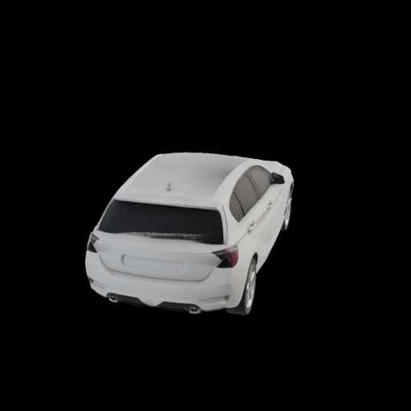 |
| Yellow armchair — organic upholstery | 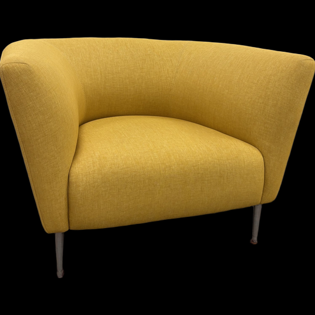 | 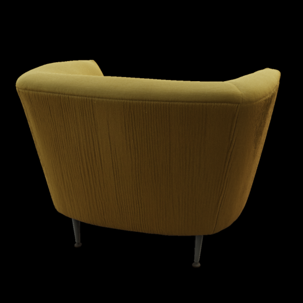 |
| Bookshelf — repeated concavities | 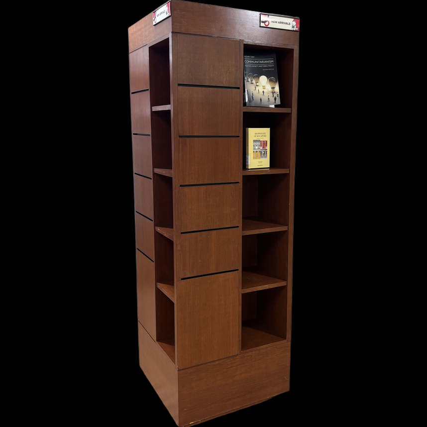 | 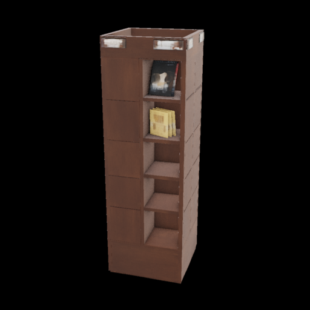 |

### Diffusion Strips

#### White hatchback

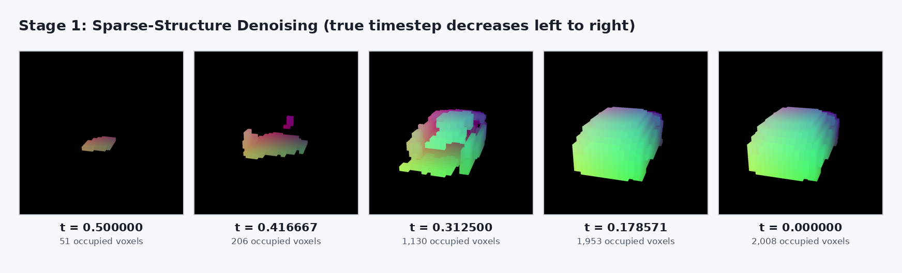

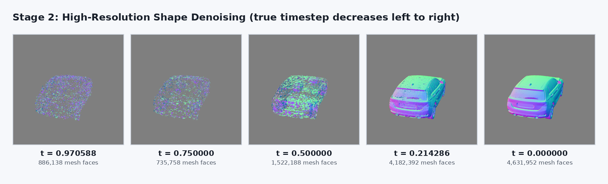

#### Yellow armchair

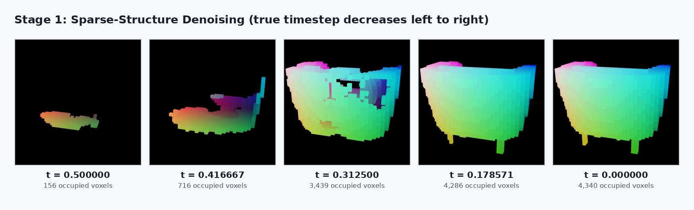

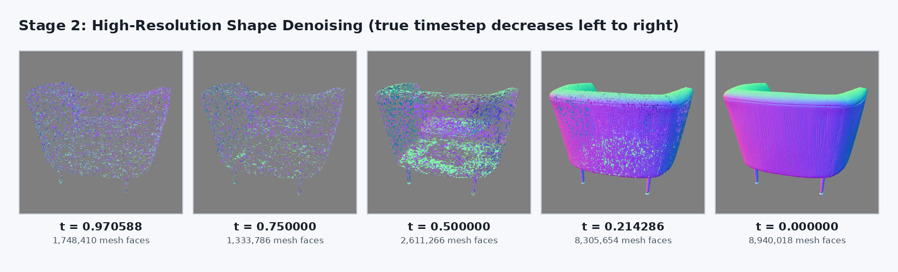

#### Bookshelf

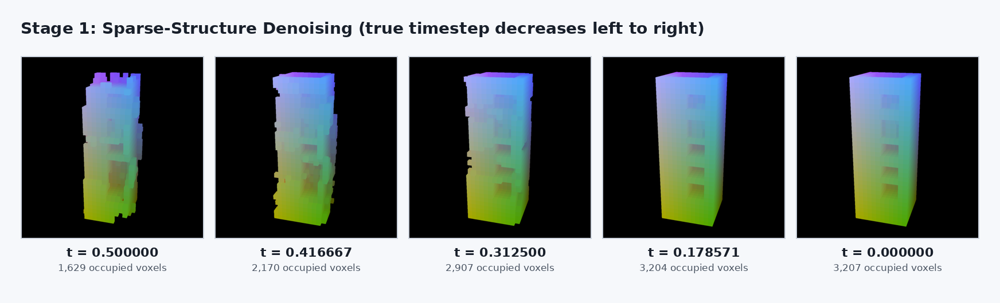

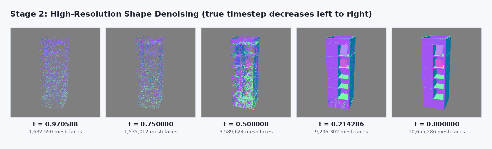

### Results and Observations

| Case | Final Stage 1 occupancy | Final Stage 2 decoded faces | Final output mesh | Qualitative observation |
|---|---:|---:|---:|---|
| White hatchback | 2,008 voxels | 4,631,952 | 2,298,099 vertices / 4,648,428 faces | A small footprint becomes a coherent car volume in Stage 1; Stage 2 resolves windows, wheels, and the rear body. Fine surface and unseen details remain softened. |
| Yellow armchair | 4,340 voxels | 8,940,018 | 4,470,146 vertices / 8,982,054 faces | The enclosing curved back and thin legs emerge clearly. The fixed rear view also exposes plausible inference of an unseen surface, although the rear fabric grooves are exaggerated. |
| Bookshelf | 3,207 voxels | 10,655,286 | 5,283,912 vertices / 10,663,218 faces | The tall volume stabilises early, after which Stage 2 separates repeated shelves and recesses. Some compartments are asymmetric and small printed details are blurred. |

The Stage 2 face count is not expected to increase monotonically at every early step: each noisy latent is decoded independently, and topology changes while the denoising trajectory converges. The visual progression is nevertheless consistent in all three cases, with noise and fragmented surfaces giving way to coherent high-resolution geometry.

The accepted smoke run was Slurm job `856096` on node `xgph0`; the remaining formal cases were produced by job `856142` on `xgph6`. Both used an NVIDIA A100 80 GB PCIe GPU. Generation-and-capture times were 43.11 seconds for the car, 59.25 seconds for the armchair, and 40.30 seconds for the bookshelf, excluding model initialisation. The formal batch summary is stored in [`outputs/step4/formal/batch-856142/batch_summary.json`](outputs/step4/formal/batch-856142/batch_summary.json). Each case directory contains 15 captured state files (five Stage 1, five low-resolution Stage 2 evidence states, and five formal high-resolution Stage 2 states), ten rendered frames, two labelled strips, a final render, hashes, timings, and complete metadata.

## Step 5 — Composite a Scene

Not started. This step will arrange at least five generated assets into one intentionally composed 3D scene.

## Submission Checklist

### Report

- [x] Step 1: downloaded models, official sources, revisions, storage location, and substitution statement
- [x] Step 2: ordered copy-pasteable environment commands and exact versions of Python, PyTorch, CUDA, and every compiled extension
- [x] Step 3a: five original input images, selection rationale, five `.glb` assets, at least two rendered viewpoints per asset, and individual generation times
- [x] Step 3b: five project-specific prompts, the prompt template, five intermediate text-to-image outputs, five `.glb` assets, four rendered viewpoints per asset, and individual generation times
- [x] Step 3b: explain that TRELLIS.2 never receives text directly and include at least one case where the text-to-image stage limits the final result
- [x] Step 3b prompt provenance: disclose that the five prompts were AI-generated and manually reviewed and approved by the student
- [x] Step 4: select three Step 3a cases and show the input and final rendered asset for each
- [x] Step 4: two labelled strips per case, with five Stage 1 and five Stage 2 renders each, for 30 intermediate renders in total
- [x] Step 4: label every frame with its actual stage, true timestep, and a measurement
- [x] Step 4: sample Stage 1 across `t = 0.5` to `0.0`, Stage 2 across `t = 1.0` to `0.0`, and report the increased Stage 1 Euler step count
- [x] Step 4: explain both sampling locations, captured `x_t`, timestep schedules, and the separate decoding method used for each latent space
- [ ] Step 5: describe the scene concept, assembly tool, asset selection, scale, orientation, placement, and surface contact
- [ ] Step 5: include at least one rendered scene view
- [ ] Optional: document either higher-resolution generation or a production-quality creative scene, if attempted

### Files

- [ ] One PDF report containing all report items above
- [x] Five image-conditioned `.glb` assets
- [x] Five text-conditioned `.glb` assets
- [ ] One composed scene containing at least five generated assets (`.glb` preferred; `.blend` or `.usd` accepted)

### Oral Preparation

- [ ] Be able to explain the complete Step 3 conditioning chain
- [ ] Be able to explain both Step 4 flow-matching stages, sampler states, schedules, and decoders
- [ ] Be able to explain the Step 5 scene assembly and placement decisions
